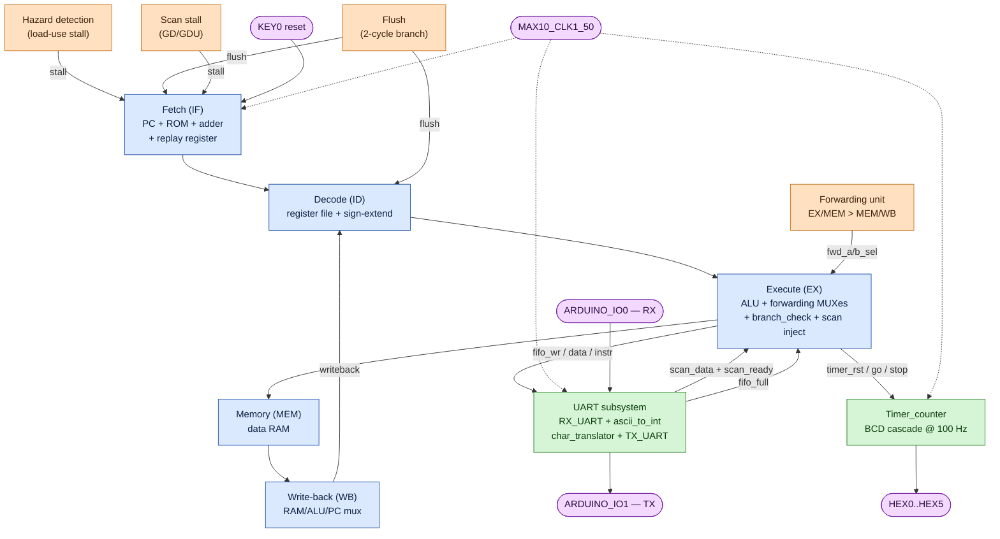

# USU-DLX Processor — Final Project

**USU ECE 6740 — Advanced Reconfigurable Computing (Spring 2026)**

| Student | A-Number |
|---------|----------|
| Nate Herbst   | A02307138 |
| Nathan Walker | A02364124 |

---

## Overview

This is a 32-bit, 5-stage pipelined DLX processor implemented in VHDL and targeted at the Intel/Altera **MAX 10 (DE-10 Lite)** FPGA. The design grew across nine semester labs and was finalized for the spring 2026 timed competition. It includes:

- A complete **5-stage pipeline** (Fetch / Decode / Execute / Memory / Write-back) with a forwarding unit, load-use hazard detection, branch flush logic, and an instruction-replay register that absorbs ROM/decode timing during stalls.
- **57 instructions** — the standard DLX ISA plus five custom serial-I/O opcodes (`PCH`, `PD`, `PDU`, `GD`, `GDU`) and three stopwatch-control opcodes (`TR`, `TGO`, `TSP`).
- A **bidirectional UART subsystem** (19,200 baud) with an ASCII-to-integer scan FSM, character translator that turns PCH/PD/PDU writes into serial bytes, and a clock-domain-crossing FIFO chain.
- A **stopwatch peripheral** that displays elapsed time as `MM.SS.hh` on the six on-board seven-segment displays.
- A **two-pass C assembler** that compiles `.dlx` source to Quartus `.mif` files, including auto-NOP insertion for load-use and scan-stall workarounds, and `\r`/`\n`/`\t` escape sequences in `.const` strings.

---

## System Block Diagram



The processor talks to the outside world through three channels:
- **Serial UART** at 19,200 baud over Arduino header pins `IO0` (RX) and `IO1` (TX). Drives the print and scan instructions.
- **Six seven-segment displays** (`HEX0`–`HEX5`) showing the stopwatch in `MM.SS.hh` format.
- **KEY0** as the active-low reset.

---

## Directory Layout

```
FinalProject_DLX_Processor/
├── FinalProject_DLX_Processor.vhd   ← Quartus top-level: wires DLX core + UART + Timer + scan-echo FSM
├── DLX_Processor.vhd                ← Pipeline integrator: forwarding, hazards, replay register
├── faster_PLL.vhd                   ← Main system PLL
├── dlx_project_files.qip            ← Aggregates all VHD/QIP into the Quartus project
├── FinalProject_DLX_Processor.qpf   ← Quartus project file
├── FinalProject_DLX_Processor.qsf   ← Quartus settings (device pinout, top-level entity)
├── FinalProject_Report.md           ← Lab report (technical writeup)
├── CLAUDE.md                        ← Notes from AI-assisted development
├── README.md                        ← (this file)
│
├── FetchModules/                    ← IF stage
│   ├── fetch.vhd                    ← PC, ROM, +1 adder, jump MUX, stall-aware
│   ├── fetch_pkg.vhd
│   ├── Register/                    ← Generic N-bit registers (sync + async reset)
│   ├── MUX/                         ← Generic 2:1 N-bit MUX
│   └── ripple_adder/                ← Half/full/N-bit ripple adder for PC+1
│
├── DecodeModules/                   ← ID stage
│   ├── decode.vhd                   ← Reg-file read, sign-extend, IF/ID latch
│   ├── decode_reg/
│   │   ├── decode_reg.vhd           ← 32×32 register file (with bypass-fix)
│   │   └── decode_reg_pkg.vhd       ← Opcode constants table (ISA reference)
│   └── sign_extend/                 ← 16→32 sign extender
│
├── ExecuteModules/                  ← EX stage
│   ├── execute.vhd                  ← ALU control + forwarding MUXes + scan inject + timer/print outs
│   ├── ALU.vhd                      ← Combinational 32-bit ALU
│   └── branch_check.vhd             ← Branch condition evaluator (BEQZ/BNEZ/J/JR/JAL/JALR)
│
├── HazardModules/                   ← Pipeline hazard control
│   ├── hazard_detection.vhd         ← Load-use stall detection
│   └── forwarding_unit.vhd          ← EX/MEM and MEM/WB forwarding selector
│
├── MemoryWriteBackModules/          ← MEM and WB stages
│   ├── Memory/
│   │   ├── Memory.vhd               ← Data RAM interface, store-enable
│   │   └── RAM/                     ← Quartus altsyncram (DLX_RAM)
│   └── Write_back/
│       └── write_back.vhd           ← Writeback MUX (RAM / ALU / PC)
│
├── Timer/                           ← Stopwatch peripheral
│   ├── Timer_counter.vhd            ← BCD cascade state machine (TR/TGO/TSP)
│   ├── HEX_seven_seg_disp.vhd       ← Single-digit BCD → 7-seg encoder
│   ├── HEX_seven_seg_disp_6.vhd     ← Six-digit display wrapper
│   └── time_pll_1.vhd               ← (Quartus IP, unused in final)
│
├── UART/                            ← Serial I/O subsystem (19,200 baud)
│   ├── RX_UART.vhd                  ← 8x oversampled receiver
│   ├── TX_UART.vhd                  ← Transmitter
│   ├── ascii_to_int.vhd             ← ASCII digit stream → 32-bit integer FSM
│   ├── char_translator.vhd          ← PCH/PD/PDU formatter (digit stack + division pipeline)
│   ├── stack.vhd                    ← LIFO byte stack used by char_translator
│   ├── PLL_UART.vhd                 ← Generates 153.6 kHz / 19.2 kHz clocks
│   └── FIFO.vhd, UART_TX_DATA.vhd, UART_SIGN_DATA.vhd, division.vhd  ← Quartus megafunctions
│
├── ROMs/                            ← Instruction memories (Quartus IP)
│   ├── DLX_ROM.vhd                  ← The active ROM in the build
│   └── code1_ROM/, code2_ROM/, code3_ROM/, factorial_ROM/, no_jump_ROM/  ← Older ROM variants
│
├── multiplication/                  ← LPM_MULT IP for ascii_to_int's ×10 step
│
└── DLXAssembler/                    ← Two-pass C assembler + test programs
    ├── Assembler.c                  ← Pass 2: code generation + escape sequences + auto-NOP
    ├── find_labels.c                ← Pass 1: label address discovery
    ├── structs.h                    ← label and opcode structs
    ├── DLX_Instructions.md          ← Full ISA reference table
    ├── README.md                    ← Assembler walkthrough
    ├── *.dlx                        ← Source programs (factorial, hazard_test, etc.)
    ├── *.mif                        ← Assembled outputs (loaded into ROM/RAM at synth time)
    ├── ExampleDLX_Files/            ← Instructor-provided programs (square, prime, collatz, lcm)
    └── FinalExamFiles/              ← Programs for the timed competition
```

---

## Build & Run

### Hardware
- DE-10 Lite (Intel/Altera MAX 10, device `10M50DAF484C7G`)
- USB-Blaster cable for programming
- 3.3 V USB-TTL serial cable on Arduino header pins `IO0` (RX) and `IO1` (TX)

### Toolchain
- Quartus Prime 16.0 (project was created here) or Quartus Prime Lite 23.1 (works)
- Any GCC for the assembler (used `gcc` on Linux)
- Any serial terminal (PuTTY, minicom, screen) at **19,200 baud, 8N1, no flow control**

### Program the FPGA
1. Open `FinalProject_DLX_Processor.qpf` in Quartus.
2. **Processing → Start Compilation**.
3. **Tools → Programmer**, add the generated `.sof`, click **Start**.

### Loading a different program into ROM/RAM
1. Build the assembler (only needed once):
   ```bash
   cd DLXAssembler
   gcc -o dlx_asm Assembler.c find_labels.c
   ```
2. Assemble a `.dlx` source — produces a code MIF and a data MIF:
   ```bash
   ./dlx_asm hazard_test.dlx hazard_test_data.mif hazard_test_code.mif
   ```
3. Update the `init_file =>` strings in `ROMs/DLX_ROM.vhd` (code) and `MemoryWriteBackModules/Memory/RAM/factorial_ram.vhd` (data) to point at the new MIFs.
4. Recompile in Quartus and reprogram.

### Connecting the serial terminal
- The TX line is `ARDUINO_IO(1)` → connect to USB-TTL RX.
- The RX line is `ARDUINO_IO(0)` ← connect to USB-TTL TX.
- 19,200 baud, 8 data bits, no parity, 1 stop bit, no flow control.
- Open the terminal **before** pressing reset (KEY0) so the welcome banner isn't lost.

---

## Instruction Set (quick reference)

The full ISA (57 opcodes) is documented in [`DLXAssembler/DLX_Instructions.md`](DLXAssembler/DLX_Instructions.md). Highlights:

| Group | Opcodes | Notes |
|-------|---------|-------|
| ALU R/I-type | `ADD ADDI ADDU ADDUI SUB SUBI SUBU SUBUI AND ANDI OR ORI XOR XORI` | Standard arithmetic and logic |
| Shifts | `SLL SLLI SRL SRLI SRA SRAI` | Logical and arithmetic shifts |
| Set-on-comparison | `SLT SLTI SLTU SLTUI SGT SGTI SGTU SGTUI SLE SLEI SLEU SLEUI SGE SGEI SGEU SGEUI SEQ SEQI SNE SNEI` | Both signed and unsigned variants |
| Memory | `LW SW` | Load/store; assembler auto-inserts a NOP after `LW` for the load-use bubble |
| Control flow | `BEQZ BNEZ J JR JAL JALR` | 2-cycle branch flush, JAL/JALR write PC+1 to R31 |
| Serial I/O | `PCH PD PDU GD GDU` | Output character / signed dec / unsigned dec; input signed / unsigned. Assembler auto-inserts a NOP after `GD`/`GDU` for the scan-stall window. |
| Stopwatch | `TR TGO TSP` | Reset, start, stop. No operands. Display refreshes at 100 Hz. |

---

## Reference

- Per-lab reports for the build history (in sibling folders):
  - `Lab1_DLX_*` through `Lab9_DLX_Scan/` — each lab's design notes and its own report
- Final project writeup: [`FinalProject_Report.md`](FinalProject_Report.md)
- Project requirements: [`FinalProjectRequirements_Spring2026.md`](FinalProjectRequirements_Spring2026.md)
- Assembler walkthrough: [`DLXAssembler/README.md`](DLXAssembler/README.md)
- Full ISA table: [`DLXAssembler/DLX_Instructions.md`](DLXAssembler/DLX_Instructions.md)

---

## Acknowledgments

Course taught by **Dr. Phillips** at Utah State University. The custom serial-I/O instructions and stopwatch peripheral were specified in the Spring 2026 final-project handout; the rest of the ISA follows the textbook DLX architecture.
